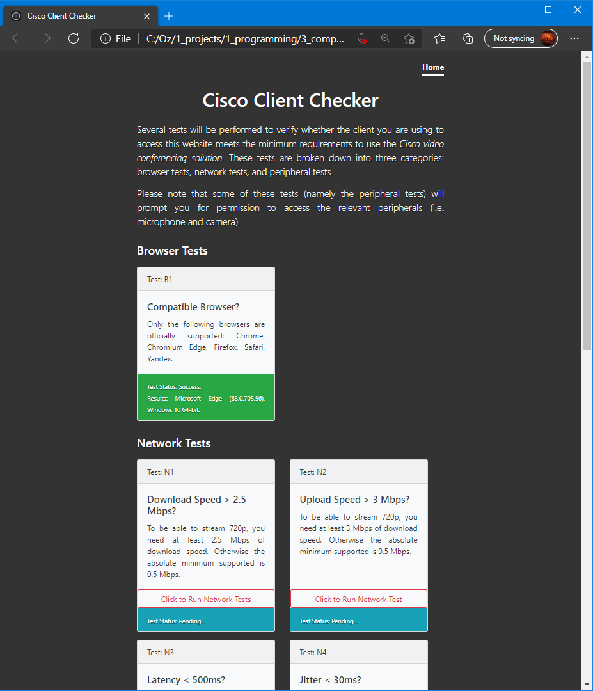

Project Cisco
=============

  

Overview
--------
Project Cisco is a simple webapp that is designed to be hosted on AWS or equivalent. Users are encouraged to access 
this webapp before joining a Cisco CMS meeting to ensure that they meet the minimum requirements to join (in terms of 
browser, network speed, and peripherals).

Motivation
----------
A class of end-user issues stems from incompatible browsers, insufficient network speed (upload/download), or forgetting to grant the browser permissions to peripherals (i.e. micrphone, speaker, and camera). Such issues can easily be resolved by the end-user without needing to involve system operators. This webapp has been developed to solve this class of end-user issues, thus saving time and effort and increasing customer satisifcation.

How to Use
----------
To run locally, double click `index.html`. Otherwise, deploy on AWS or equivalent as a webapp.

Key Features
------------
- Browser Test: Checks whether the current browser being used is compatible with Cisco CMS (Webbridge 2)
- Network Test: Runs a speed test that measures download/upload speed, latency, and jitter against CMS recommendations.
- Peripheral Test: Checks whether the browser has been granted permissions to peripherals (i.e. mic, speaker, and camera).

Limitations
-----------
- Network algorithm is primitive and could benefit from an upgrade that involves multi-stream upload/downloads.

Project Structure
-----------------
- `index.html`, entry point to the webapp.

- `backend/`
    - `empty.php`, used for the upload and ping portion of the speed test.
    - `garbage.php`, used for the download portion of the speed test.
    - `getIP.php`, used to fetch the IP for the speed test.

- `css/`, contains CSS stylesheets.
- `js/`, contains 3rd party libraries.
- `assets/`, contains demo screenshots.

Authors
-------
|      Name      |           Email           | 
| -------------- |:-------------------------:| 
| Othman Alikhan |    oz.alikhan@gmail.com   | 

Acknowledgements
----------------
##### Reference Code
- Below are scripts that were used or heavily inspired this project:
    - @alfeg https://github.com/alfg/ping.js/
    - https://github.com/bestiejs/platform.js#readme
    - https://github.com/muaz-khan/DetectRTC
